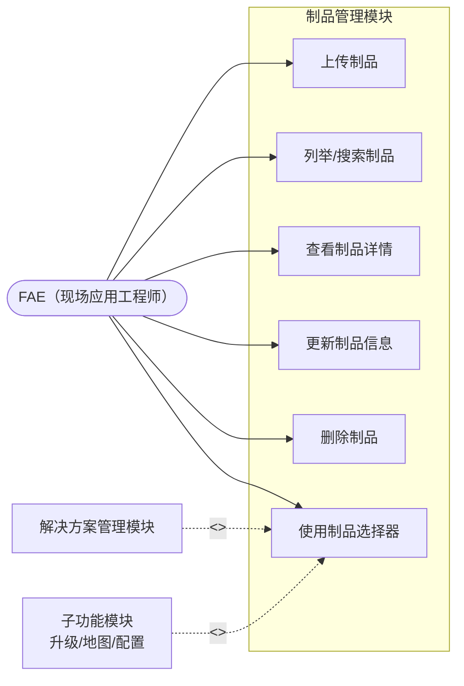

# 制品管理模块 — 需求规格说明书

## 1. 概述

制品管理模块是 RobotOps Studio 的全局共享资源管理中心，负责不可变大文件（固件包、地图文件、日志压缩包等）的完整生命周期管理。该模块独立于解决方案模块运行，任何解决方案内的子功能（升级包管理、地图管理等）均通过**引用**方式使用全局制品，而非将制品直接存储在解决方案目录下。

**关键用例**：用户必须先通过本模块完成制品的新增（上传），才能在解决方案配置时选择并引用该制品。

---

## 2. 术语定义

| 术语 | 定义 |
|------|------|
| **制品（Artifact）** | 全局存储的不可变大文件，可被多个解决方案引用。典型类型包括固件包（BSP/OS）、地图文件、程序配置包、日志压缩包等。 |
| **制品元数据（Artifact Meta）** | 描述制品属性的 JSON 文档，包含文件名、大小、校验和、引用计数等。 |
| **制品引用（Artifact Reference）** | 解决方案或其子资源中对全局制品的指针，至少包含 `artifactId` 和 `purpose` 字段。 |
| **引用计数（Ref Count）** | 当前有多少个解决方案实体正在引用该制品。用于生命周期管理和垃圾回收决策。 |
| **校验和去重（Checksum Deduplication）** | 上传时计算文件校验和，若已存在相同校验和的制品，则复用已有文件，不重复存储。 |

---

## 3. 设计原则

1. **全局共享**：制品作为独立顶层资源存储，不从属于任何解决方案，支持跨解决方案复用。
2. **先存后引**：必须先完成制品的上传（或确认本地已存在），才能在解决方案配置流程中选择引用。引用时系统提供制品选择器，仅展示已存在的制品列表。
3. **不可变性**：一旦上传，制品文件内容不可修改。如需更新，必须上传新版本并生成新的制品记录。
4. **引用计数驱动生命周期**：制品的创建由用户主动上传触发；制品的删除受 `refCount` 保护，仅当无引用时才允许删除。
5. **校验和去重**：相同内容的文件在全局只保留一份物理存储，节省磁盘空间。

---

## 4. 对象存储映射

### 4.1 目录布局

```
v1/
└── artifacts/
    ├── {artifact-id-1}.bin              # 制品文件，扩展名由 Content-Type 推断
    ├── {artifact-id-1}_meta.json        # 制品元数据
    ├── {artifact-id-2}.zip
    ├── {artifact-id-2}_meta.json
    └── ...
```

> **说明**：制品元数据作为独立资源存储，命名约定为 `<artifactId>_meta`。写入时 Content-Type 为 `application/json`，由对象存储自动推断扩展名为 `.json`。

### 4.2 路径规则

| 实体 | 对象存储路径 | Content-Type |
|------|-------------|--------------|
| 制品文件 | `v1/artifacts/{artifactId}` | 按实际文件类型推断（例如 `application/x-firmware`、`application/zip`） |
| 制品元数据 | `v1/artifacts/{artifactId}_meta` | `application/json` |

> **注**：元数据作为独立对象存储资源，命名约定为 `{artifactId}_meta`。Content-Type 为 `application/json`，对象存储自动将其存储为 `{artifactId}_meta.json`。

---

## 5. 数据模型

### 5.1 制品元数据 Schema

```json
{
  "$schema": "http://json-schema.org/draft-07/schema#",
  "type": "object",
  "required": ["id", "fileName", "size", "checksum", "createdAt", "refCount"],
  "properties": {
    "id": { "type": "string", "pattern": "^[a-zA-Z0-9_-][a-zA-Z0-9_.-]*$" },
    "fileName": { "type": "string", "minLength": 1, "description": "原始上传文件名" },
    "size": { "type": "integer", "minimum": 0, "description": "文件大小（字节）" },
    "checksum": { "type": "string", "description": "SHA-256 十六进制摘要" },
    "contentType": { "type": "string", "description": "MIME 类型" },
    "createdAt": { "type": "string", "format": "date-time" },
    "refCount": { "type": "integer", "minimum": 0, "description": "当前被多少个解决方案实体引用" },
    "tags": {
      "type": "array",
      "items": { "type": "string", "maxLength": 64 },
      "maxItems": 16
    },
    "metadata": {
      "type": "object",
      "additionalProperties": true,
      "description": "用户自定义扩展字段，例如 version、targetModel、releaseDate"
    }
  }
}
```

### 5.2 制品引用 Schema（由解决方案子资源使用）

```json
{
  "type": "object",
  "required": ["artifactId", "purpose"],
  "properties": {
    "artifactId": { "type": "string" },
    "purpose": { "type": "string", "description": "用途说明，例如 BSP 升级包、楼层地图" },
    "addedAt": { "type": "string", "format": "date-time", "description": "引用创建时间" }
  }
}
```

### 5.3 示例

**制品元数据示例**：

```json
{
  "id": "bsp-v2-3-1-a7b2c3",
  "fileName": "bsp_v2.3.1_release.fw",
  "size": 16777216,
  "checksum": "e3b0c44298fc1c149afbf4c8996fb92427ae41e4649b934ca495991b7852b855",
  "contentType": "application/x-firmware",
  "createdAt": "2026-05-20T08:00:00.000Z",
  "refCount": 3,
  "tags": ["bsp", "x100", "release"],
  "metadata": {
    "version": "2.3.1",
    "targetModel": "X100",
    "releaseDate": "2026-05-18"
  }
}
```

**制品引用示例**（存储在解决方案的 `upgrade-packages/{pkgId}.json` 中）：

```json
{
  "name": "BSP v2.3.1",
  "description": "Building 3 初始 BSP",
  "artifactRef": {
    "artifactId": "bsp-v2-3-1-a7b2c3",
    "purpose": "BSP upgrade package for initial deployment",
    "addedAt": "2026-05-27T10:00:00.000Z"
  }
}
```

---

## 6. 功能需求

### 6.1 上传制品

**FR-ART-001**：系统应支持用户从本地文件系统上传制品到全局存储。

- 输入：本地文件路径或文件流。
- 系统读取文件并计算 SHA-256 校验和。
- 系统查询是否已存在相同校验和的制品：
  - 若存在，返回已有制品元数据，提示用户可直接引用该制品（去重）。
  - 若不存在，继续上传流程。
- 系统生成唯一 `artifactId`（规则：`{slugified-file-name}-{nanoid(6)}` 或用户自定义）。
- 系统将文件写入对象存储 `v1/artifacts/{artifactId}`。
- 系统创建制品元数据，初始 `refCount = 0`，并写入对象存储 `v1/artifacts/{artifactId}_meta`（Content-Type: `application/json`）。
- 返回完整制品元数据。

**FR-ART-002**：上传过程中应显示进度指示器（百分比或已传输大小）。

**FR-ART-003**：上传应支持取消操作，取消后不应残留不完整文件或元数据。

**FR-ART-003a**：系统应支持批量上传多个制品。

- 用户可一次选择多个本地文件（拖拽或文件选择框多选）。
- 系统对队列中的每个文件依次执行上传流程（计算校验和、去重检查、写入存储、创建元数据）。
- 每个文件独立显示上传进度和状态（待上传/上传中/已完成/已去重/失败）。
- 队列中任一文件失败不应阻断其他文件继续上传。
- 支持取消队列中尚未开始上传的文件；已开始上传的文件按 FR-ART-003 规则处理。
- 全部完成后，系统展示上传结果汇总（成功数、去复用数、失败数）。

### 6.2 列举制品

**FR-ART-004**：系统应支持列举全局所有制品。

- 列表展示：`id`、`fileName`、`size`、`checksum`、`contentType`、`refCount`、`createdAt`。
- 列表默认按 `createdAt` 降序排列。
- 支持按 `fileName`（子串匹配）过滤。
- 支持按 `contentType`（精确匹配）过滤。
- 支持按 `checksum`（精确匹配）过滤，用于确认某个本地文件是否已上传。
- 支持按 `refCount` 升序/降序排序，方便识别孤儿制品（`refCount == 0`）。
- 支持按 `tags`（任意标签精确匹配）过滤。

**FR-ART-005**：列表中 `refCount == 0` 的制品应显示 "未被引用" 视觉标记，提示用户可安全清理。

### 6.3 查看制品详情

**FR-ART-006**：系统应支持查看单个制品的完整元数据。

- 展示字段：元数据全部字段。
- 提供下载按钮，允许将制品文件保存到本地。

### 6.4 更新制品元数据

**FR-ART-007**：系统应允许更新制品的可变元数据字段。

- 可变字段：`tags`、`metadata`。
- 不可变字段：`id`、`fileName`、`size`、`checksum`、`contentType`、`createdAt`、`refCount`。
- `refCount` 只能由系统的引用/解除引用机制修改，禁止用户手动编辑。

### 6.4.1 解析制品存储路径

**FR-ART-007a**：系统应提供接口根据 `artifactId` 解析制品文件在对象存储中的真实路径。

- 接口：`getArtifactPath(artifactId: string): Promise<string>`
- 返回制品文件在底层存储中的绝对路径（当存储后端为本地文件系统时）。
- 路径由底层对象存储在写入时确定，无需写入元数据。
- 若制品不存在，抛出 `ArtifactNotFoundError`。
- 用于优化文件传输任务：调用方通过此接口获取制品路径后可直接读取文件，无需先下载到临时目录。

### 6.5 删除制品

**FR-ART-008**：系统应支持删除制品。

- 仅允许删除 `refCount == 0` 的制品。
- 删除时通过弹窗确认，展示制品文件名并提示操作不可撤销。
- 删除操作同时移除对象存储中的制品文件（`v1/artifacts/{artifactId}`）及其元数据（`v1/artifacts/{artifactId}_meta`）。
- 若 `refCount > 0`，拒绝删除并提示："该制品正被 {refCount} 个解决方案引用，请先解除引用。"

### 6.6 引用计数管理

**FR-ART-009**：系统应自动维护制品的 `refCount`。

- 当解决方案或其子资源首次引用某制品时，系统原子性递增该制品的 `refCount`。
- 当引用被移除（删除引用文件、删除包含引用的解决方案等）时，系统原子性递减该制品的 `refCount`。
- `refCount` 最小值为 0，禁止递减至负数。
- 引用不存在的 `artifactId` 时，操作被拒绝并提示制品不存在。

**FR-ART-010**：系统应支持在 UI 中展示制品的当前引用数量和引用状态。

### 6.7 制品选择器（供其他模块调用）

**FR-ART-011**：系统应提供制品选择器组件/接口，供解决方案配置流程调用。

- 选择器以弹窗或抽屉形式展示制品列表。
- 支持按 `contentType` 预过滤（例如仅展示固件类型制品）。
- 支持按 `fileName` 实时搜索。
- 支持 `refCount` 排序。
- 选择器内提供"上传新制品"入口，允许用户在选择过程中直接上传新文件。
- 返回选中的 `artifactId` 及基础信息（`fileName`、`size`、`checksum`），供调用方构建引用。

> **典型调用场景**：FAE 在配置某解决方案的 BSP 升级包时，点击"选择升级包"，系统弹出制品选择器；FAE 可选择已有制品，或当场上传新的固件包。

---

## 7. 用例模型

### 7.1 用例图



### 7.2 用例说明

| 用例编号 | 用例名称 | 参与者 | 前置条件 | 后置条件 | 主事件流 |
|---------|---------|--------|---------|---------|---------|
| UC-ART-01 | 上传制品 | FAE | 无 | 新制品出现在全局列表，可被引用 | 1. FAE 选择本地文件（支持批量）；2. 系统计算校验和并检查重复；3. 系统写入文件及元数据（`refCount = 0`）；4. 系统返回制品信息 |
| UC-ART-02 | 列举/搜索制品 | FAE | 无 | 展示过滤后的制品列表 | 1. FAE 打开制品管理页面；2. 系统加载全部元数据；3. FAE 可输入关键词或选择过滤条件；4. 系统返回排序后的列表 |
| UC-ART-03 | 查看制品详情 | FAE | 制品已存在 | 展示完整元数据及操作入口 | 1. FAE 在列表中选择某制品；2. 系统读取元数据；3. 系统展示信息并提供下载按钮 |
| UC-ART-04 | 更新制品信息 | FAE | 制品已存在 | 元数据已更新 | 1. FAE 编辑标签或自定义元数据；2. 系统校验；3. 系统更新元数据 |
| UC-ART-05 | 删除制品 | FAE | 制品已存在且 `refCount == 0` | 制品文件及元数据被移除 | 1. FAE 发起删除；2. 系统校验 `refCount`；3. 系统弹窗确认；4. 系统删除文件及元数据 |
| UC-ART-06 | 使用制品选择器 | FAE / 其他模块 | 无 | 返回选中的 `artifactId` | 1. 调用方触发选择器；2. 系统展示可引用制品列表；3. FAE 选择已有制品或当场上传新制品；4. 系统返回选中制品 ID |

### 7.3 参与者说明

| 参与者 | 描述 | 关联用例 |
|--------|------|---------|
| FAE（现场应用工程师） | 主要用户，负责上传、管理和选择制品 | UC-ART-01 ~ UC-ART-06 |
| 解决方案管理模块 | 在克隆/导出/删除解决方案时，自动维护制品引用计数 | 间接参与 UC-ART-05、UC-ART-06 |
| 子功能模块（升级/地图/配置） | 在配置流程中调用制品选择器，创建制品引用 | UC-ART-06 |

---

## 8. 与其他模块的交互契约

### 8.1 与解决方案管理模块的交互

| 场景 | 制品模块行为 | 解决方案模块行为 |
|------|------------|----------------|
| 解决方案创建引用 | 接收 `incrementRefCount(artifactId)` 调用，递增 `refCount` | 在写入引用文件后调用制品模块接口 |
| 解决方案删除引用 | 接收 `decrementRefCount(artifactId)` 调用，递减 `refCount` | 在删除引用文件或删除整个解决方案后调用制品模块接口 |
| 解决方案克隆 | 接收批量 `incrementRefCount` 调用 | 复制所有引用文件后，批量递增对应制品的 `refCount` |
| 解决方案导入 | 若导入的 ZIP 包含对制品的引用，需校验制品是否存在 | 导入完成后，对有效引用递增 `refCount`；对失效引用提示用户 |
| 解决方案导出 | 不直接参与 | 导出引用文件（JSON），不导出制品文件本身，保持归档轻量 |

### 8.2 与子功能模块（升级/地图/配置）的交互

- 子功能模块在需要引用制品时，调用 **制品选择器（FR-ART-011）**。
- 子功能模块负责构建并存储引用 JSON（包含 `artifactId`、`purpose`、`addedAt`）。
- 子功能模块在删除自身配置时，负责通知制品模块递减对应 `refCount`。

---

## 9. 校验与约束

| 约束项 | 规则 | 错误行为 |
|--------|------|---------|
| 制品 ID | 必须匹配 `^[a-zA-Z0-9_-][a-zA-Z0-9_.-]*$` | 拒绝并返回 `INVALID_ARTIFACT_ID` |
| 文件大小 | 最小 1 字节；单文件最大 2 GB（软限制） | 超限拒绝并提示 `FILE_TOO_LARGE` |
| 校验和 | 必须为有效的 SHA-256 十六进制字符串（64 字符） | 格式错误拒绝 |
| 引用计数 | 最小值为 0，禁止手动修改 | 非法操作拒绝 |
| 最大制品数 | 每工作站软限制 5000 个 | 警告，不阻塞 |
| 重复上传 | 相同校验和视为同一文件，禁止重复存储 | 返回已有制品元数据 |
| 引用存在性 | 禁止引用不存在的 `artifactId` | 拒绝并返回 `ARTIFACT_NOT_FOUND` |

---

## 10. 错误处理

| 错误码 | 触发条件 | 用户提示 |
|--------|---------|---------|
| `ARTIFACT_NOT_FOUND` | 读取/更新/删除不存在的制品；引用时指向不存在的制品 | "制品 '{artifactId}' 不存在。" |
| `ARTIFACT_ALREADY_EXISTS` | 使用重复 ID 创建（理论上校验和去重会优先命中） | "制品 '{artifactId}' 已存在。" |
| `INVALID_ARTIFACT_ID` | ID 违反安全名称正则 | "制品 ID 包含非法字符。" |
| `ARTIFACT_REFERENCED` | 尝试删除 `refCount > 0` 的制品 | "该制品正被 {refCount} 个解决方案引用，请先解除引用。" |
| `ARTIFACT_DUPLICATE_CHECKSUM` | 上传的制品校验和与已有文件相同 | "该文件已存在，可直接引用。" |
| `FILE_TOO_LARGE` | 单文件大小超过系统限制 | "文件过大，单文件上限为 2 GB。" |
| `UPLOAD_CANCELLED` | 用户在上传过程中取消 | "上传已取消，未残留临时文件。" |
| `REFCOUNT_NEGATIVE` | 引用计数计算异常导致负值 | "引用计数异常，请联系技术支持。" |

---

## 11. UI/UX 需求

**UI-ART-001**：应用应提供独立的"制品管理"入口页面，与解决方案管理并列。

**UI-ART-002**：制品列表以表格形式展示，列包括：文件名、大小、类型、引用数、上传时间、操作按钮（查看、下载、删除）。

**UI-ART-003**："未被引用"（`refCount == 0`）的制品行应以特殊背景色或标签醒目提示。

**UI-ART-004**：上传制品时应提供拖拽上传区域，支持点击选择文件。

**UI-ART-005**：上传进度应以进度条展示，上传完成后自动刷新列表。

**UI-ART-006**：制品选择器应以弹窗/抽屉形式出现，顶部有搜索框，底部有"上传新制品"按钮和"确认选择"按钮。

**UI-ART-007**：制品详情页应展示完整元数据，并提供下载按钮。

---

## 12. 非功能需求

**NF-ART-001**：计算 1 GB 文件的 SHA-256 校验和应在 5 秒内完成（标准 SSD）。

**NF-ART-002**：上传过程必须流式传输，不得将整个文件加载到内存。

**NF-ART-003**：列举 5000 个制品元数据在标准 SSD 上必须在 3 秒内完成。

**NF-ART-004**：引用计数操作必须具备原子性，并发增减 `refCount` 不应产生竞态条件导致数据不一致。

**NF-ART-005**：上传取消后，对象存储中不得残留不完整文件或孤立元数据文件。

**NF-ART-006**：系统应具备后台引用计数全量扫描与修复能力。

- 应用启动时或按配置周期（默认每天一次），后台任务自动遍历所有解决方案的子资源，统计每个制品的实际被引用次数。
- 将扫描结果与制品元数据中持久化的 `refCount` 进行比对。
- 发现不一致时，以扫描结果为准，自动修正 `refCount`。
- 扫描过程不应阻塞用户正常操作，使用低优先级异步执行。
- 扫描完成后，若发现修复了异常，应记录日志并在 UI 中以非打扰方式提示（例如状态栏图标或通知中心）。

---

## 13. 迁移与版本管理

**MIG-ART-001**：制品元数据 Schema 包含隐式版本管理，通过 `metadata` 字段的扩展实现向后兼容。

**MIG-ART-002**：若未来更换校验和算法，应引入 `checksumAlgorithm` 字段标识算法类型，保持旧数据可读。


